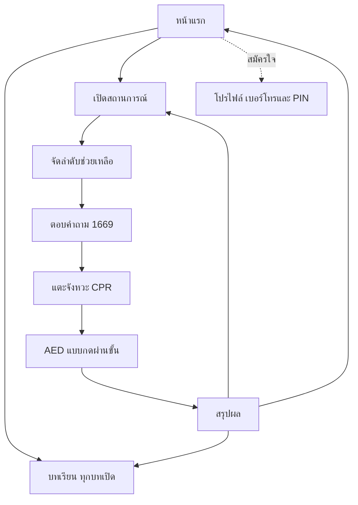
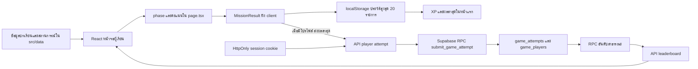
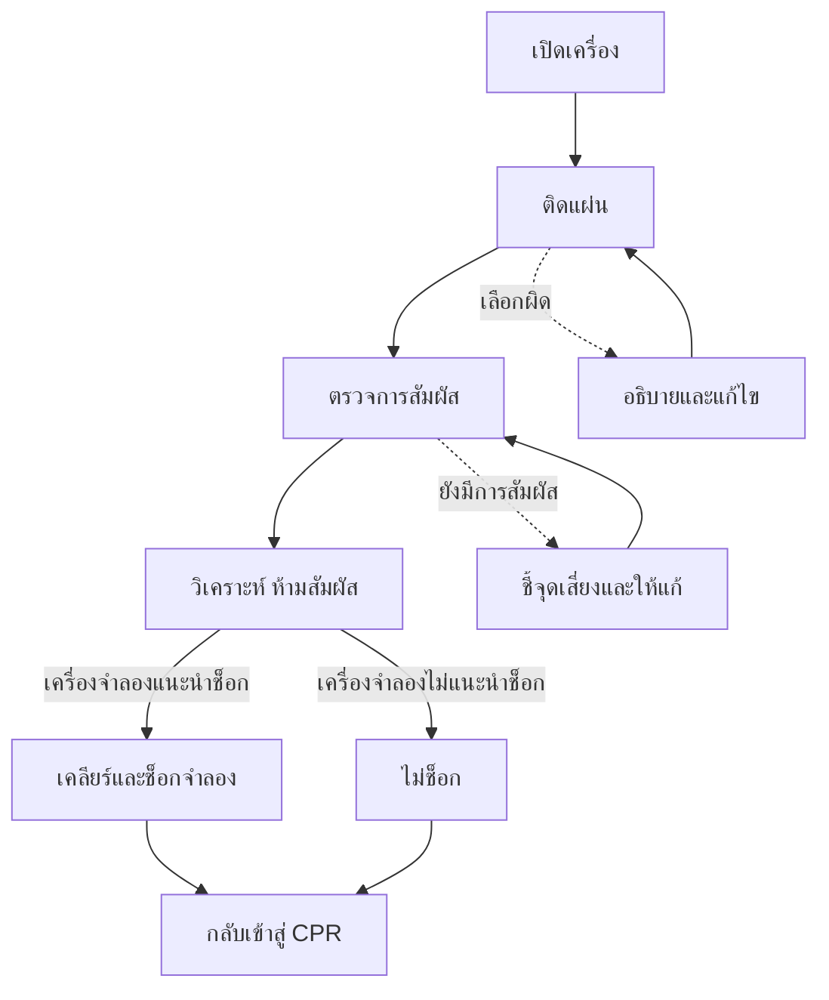
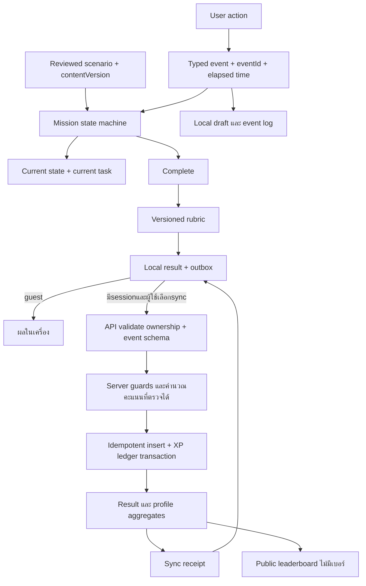

# น้องพร้อม — แผนพัฒนาประสบการณ์ใช้งานและโครงสร้างระบบ

วันที่ตรวจ: 3 ตุลาคม 2026  
ฐานโค้ด: `main` / `7e1f152`  
เว็บไซต์: https://rordor37.vercel.app/  
สถานะเอกสาร: ข้อค้นพบตั้งต้นวันที่ 3 ตุลาคม 2026; หลังจากนั้นเริ่มลงมือแล้ว ข้อความ “ปัจจุบัน” ด้านล่างหมายถึง baseline ที่ตรวจ ไม่ใช่สถานะล่าสุด

สถานะและเกณฑ์รับงานล่าสุด: [RELEASE_GATES_AND_PILOT.md](./RELEASE_GATES_AND_PILOT.md), [ระยะ A](./PHASE_A_IMPLEMENTATION.md), [ระยะ B](./PHASE_B_IMPLEMENTATION.md), [ระยะ C ชุดแรก](./PHASE_C_IMPLEMENTATION.md) และ [ชุดงานต่อเนื่อง C–F](./PHASE_C_F_INCREMENT.md)

## 1. สรุปตรงไปตรงมา

ปัญหาหลักไม่ใช่การขาดสีหรือภาพ แต่เป็นการไม่มีระบบจัดลำดับความสำคัญที่คงเส้นคงวา หน้าจอต่าง ๆ ใช้หัวข้อใหญ่ กล่องสี เลขขั้นตอน และข้อความเน้นหลายชุดพร้อมกัน ผู้ใช้จึงต้องตีความว่าอะไรคือสถานะ อะไรคือคำสั่ง และอะไรเป็นข้อมูลเสริมเอง

หน้า AED เป็นตัวอย่างชัดที่สุด: ชื่อภารกิจ คำเกริ่น ตัวนับขั้น กล่องคำสั่ง ข้อควรระวัง และปุ่มทำต่อเรียงตามโครงสร้างคอมโพเนนต์ แต่ยังไม่ใช่โครงสร้างที่ช่วยให้ผู้เรียนมองเห็นสิ่งที่ต้องทำก่อน การเปลี่ยนทุกอย่างเป็นแดงไม่ได้แก้ปัญหานี้

ที่สำคัญ ระบบผลลัพธ์บางส่วนยังไม่ตรงกับสิ่งที่วัดจริง AED ให้ 100 คะแนนเมื่อกดครบขั้น และ timeline ใช้เวลาคงที่ หากปรับเพียงภาพลักษณ์ จะทำให้ระบบดูน่าเชื่อถือขึ้นโดยไม่ได้ทำให้ข้อมูลน่าเชื่อถือขึ้น ต้องแก้ทั้งสองอย่างควบคู่กัน

ทิศทางที่เสนอ: **80% Minimal Interface + 20% Expressive Moments** ไม่ใช่สี 80% กับสี 20% แบบตายตัว ใช้ความเรียบเพื่ออ่านและตัดสินใจ ใช้ความสนุกเฉพาะการเริ่มภารกิจ จังหวะการฝึก และการเห็นพัฒนาการ

## 2. ขอบเขตและระดับความมั่นใจ

ตรวจจากโค้ด `src/app/page.tsx`, layout, CSS, components หลัก, learning, sequence, 1669, CPR, AED, debrief, progress, player API และ migration ที่เกี่ยวข้อง พร้อมเปิดเว็บ production ตรวจหน้าแรก รายการบทเรียน และรายละเอียด AED

ตรวจรายละเอียดบทเรียน AED ด้วย viewport 390×844, 768×1024 และ 1440×900: ไม่พบ horizontal overflow ของ document ในหน้านี้ ขนาด H1 บนมือถือ 28px และหัวข้อส่วน 20px การไม่ล้นจอ **ไม่เท่ากับ** ใช้งานง่ายหรือผ่าน accessibility ทั้งระบบ

ข้อจำกัด:

- รอบนี้ยังไม่ได้เล่นภารกิจครบทุกเส้นทางผ่านเบราว์เซอร์ หน้า AED ภารกิจวิเคราะห์จาก source และภาพที่ผู้ใช้ส่ง ไม่กล่าวอ้างว่าได้ทดสอบ interaction ใหม่ครบแล้ว
- ยังไม่มี usability test กับนักศึกษาวิชาทหารจริง ข้อสรุปเรื่องความยากในการสแกนเป็น heuristic และสอดคล้องกับ feedback ผู้ใช้ ไม่ใช่ผลวิจัยเชิงสถิติ
- ไม่ได้ยืนยันฐานข้อมูล production ทุกตารางและทุก policy ใหม่ในรอบนี้ schema ใน repo ไม่ใช่หลักฐานว่าฟีเจอร์นั้นถูกเชื่อมใช้งานแล้ว
- เอกสารนี้ไม่ใช่การรับรองความถูกต้องทางการแพทย์ ข้อความ ขั้นตอน ภาพตำแหน่งแผ่น และเกณฑ์การประเมินต้องผ่านครูฝึก/ผู้เชี่ยวชาญก่อนเผยแพร่
- `docs/ux-review.md` เป็นบันทึกเก่า มีทั้ง font และทิศทางสีที่ไม่ตรงกับโค้ดปัจจุบัน ห้ามใช้ผลทดสอบเก่ามารับรองการแก้ในอนาคต

## 3. ผู้ใช้และงานที่ต้องช่วยให้สำเร็จ

| ผู้ใช้/บริบท | สิ่งที่ต้องทำ | สิ่งที่ UI ต้องช่วย | สิ่งที่ไม่ควรบังคับ |
|---|---|---|---|
| ผู้เรียนครั้งแรก ใช้มือถือ | เข้าใจว่าแอปทำอะไร และเริ่มได้ | ทางเริ่มชัด อธิบายการจำลองสั้น ๆ | สมัครก่อนเรียน |
| ผู้เรียนกลับมาทบทวน | เปิดเฉพาะบทที่ต้องการ | ทุกบทเปิด ชื่อบทอ่านรู้เรื่อง | เรียนตามเลขเพื่อปลดล็อก |
| ผู้ฝึกภารกิจ | อ่าน → ประเมิน → เลือก → ลงมือ | หนึ่งงานหลักต่อช่วง และ feedback ใกล้คำตอบ | อ่านรายละเอียดโครงการกลางภารกิจ |
| ผู้ต้องการเก็บคะแนน | บันทึกและเห็นพัฒนาการ | โปรไฟล์แบบสมัครใจ สถานะ sync ชัด | เปิดเผยเบอร์โทรบนอันดับ |
| ครูฝึก | เห็นว่าระบบวัดอะไรและไม่ได้วัดอะไร | rubric/version/แหล่งอ้างอิงตรวจสอบได้ | ใช้คะแนนแตะจอแทนการประเมินภาคปฏิบัติ |

เป้าหมายหลัก: เข้าใจขั้นต่อไปและเหตุผลได้ ไม่ใช่ทำเวลาเร็วที่สุด แอปเป็นสื่อฝึกก่อนสถานการณ์จริง ไม่ควรทำให้เข้าใจว่าเป็นเครื่อง AED จริง สาย 1669 จริง หรือใบรับรองช่วยชีวิต

## 4. โครงสร้างที่มีจริงในปัจจุบัน

```text
src/app/page.tsx                 เจ้าของ tab, phase, score และผลภารกิจ
src/app/layout.tsx               LINE Seed Sans TH และ metadata
src/app/globals.css              tokens + รูปแบบหน้าจอ + responsive + motion
src/components/
  MobileContainer.tsx           shell / header / navigation / training focus
  HomeDashboard.tsx             hero / ทางฝึก / XP / leaderboard / ผลล่าสุด
  TrainingUI.tsx                progress / ตัวเลือก / feedback / metadata
  PlayerModal.tsx               สมัคร-เข้าโปรไฟล์ด้วยเบอร์และ PIN
  AboutModal.tsx                หน่วยฝึก / ที่ปรึกษา / คณะผู้จัดทำ
  YouTubeModal.tsx, AppDialog.tsx
src/features/
  learning/LearningCenter.tsx
  mission/SequenceGame.tsx
  emergency-call/EmergencyCallSimulation.tsx
  cpr/CPRGame.tsx
  aed/AEDSimulation.tsx
  debrief/AfterActionReview.tsx
src/data/                       บทเรียน แหล่งอ้างอิง สถานการณ์และตัวเลือก
src/lib/progress.ts             ประวัติใน localStorage
src/lib/gameProgress.ts         XP / level ในเครื่อง
src/lib/player.ts               client เรียก API โปรไฟล์/อันดับ
src/lib/playerServer.ts         cookie / ตรวจ request / response
src/lib/supabase/server.ts      server เรียก RPC ที่อนุญาต
src/app/api/player/             auth / session / leaderboard / attempt
supabase/migrations/            schema และ SQL functions
```

ทุกหน้าหลักอยู่ที่ URL `/` และเปลี่ยนผ่าน React state ไม่ใช่ route แยก การแชร์บทเฉพาะ การ refresh เพื่อกลับขั้นเดิม และ browser back จึงยังไม่ใช่ flow ที่ออกแบบไว้โดยตรง

### Flow ปัจจุบัน



ลำดับนี้คือกิจกรรมในสื่อฝึก ไม่ควรตีความว่าเหตุจริงต้องรอจบสายโทรก่อนเริ่มช่วยเหลือทุกครั้ง ต้องมีข้อความและสถานการณ์ที่อธิบายการแบ่งหน้าที่/การทำงานพร้อมกันตามแนวทางที่ผู้เชี่ยวชาญรับรอง

### การไหลของข้อมูลปัจจุบัน



| ข้อมูล | แหล่งจริงตอนนี้ | ข้อจำกัด |
|---|---|---|
| ภารกิจที่กำลังฝึก | React state | refresh ไม่ใช่ resume ที่บันทึกถาวร |
| จบบทเรียน/ผลล่าสุด/ประวัติ | localStorage | ผูกกับ browser/device ไม่ใช่บัญชีออนไลน์ |
| session ผู้เล่น | cookie ฝั่ง server | การเข้าโปรไฟล์เป็นทางเลือก |
| ผลส่งขึ้นอันดับ | API → custom game RPC | ไม่ได้ส่งรายละเอียด event ทั้งหมด |
| รายชื่ออันดับ | API อ่าน Supabase | ต้องแยกว่างจริงกับโหลดไม่สำเร็จ |
| mission_attempts / learning_completions / mission_drafts | มี migration รุ่น auth.users | ไม่ใช่ flow หลักของ custom phone/PIN ที่ UI ปัจจุบันใช้ |

อย่ารวมตารางรุ่น `auth.users` กับตาราง custom game โดยสมมติว่า user_id เท่ากับ player_id ต้องเลือก ownership model และ migration plan ก่อนเชื่อมข้อมูล

## 5. ข้อค้นพบที่ต้องแก้และหลักฐาน

P0 = ความน่าเชื่อถือ/ความเข้าใจที่ผิดเกี่ยวกับการช่วยเหลือ; P1 = งานหลักใช้งานยากหรือข้อมูลไม่ต่อเนื่อง; P2 = polish/บุคลิกภาพ

| ระดับ | ข้อค้นพบ | หลักฐาน | ผลกระทบและแนวแก้ |
|---|---|---|---|
| P0 | AED ได้ 100 เมื่อกดครบ | `AEDSimulation.tsx` callback `onCompleteStep(100, [])` | เปลี่ยนเป็นสถานะทบทวนครบ หรือวัด decision จริงก่อนให้คะแนน |
| P0 | ไม่มีเส้นทางไม่แนะนำช็อกจริง | index 2 วิเคราะห์แล้วไป index 3 เสมอ ข้อความ no-shock เป็น caption | เพิ่ม branch ของเครื่องจำลอง และห้ามช็อกเมื่อเครื่องไม่แนะนำ |
| P0 | เวลารายเหตุการณ์เป็นค่าคงที่ | `page.tsx` timeline 00:04 ถึง 01:30 | บันทึก event จริง หรือแสดงชัดว่าเป็นตัวอย่าง ไม่อ้างผลส่วนบุคคล |
| P0 | คะแนนประเมิน/เวลาไม่ได้วัดตรงตัว | assessment จาก sequence >=80; เวลา <=120 ได้90 ไม่เช่นนั้น75 | แยกตัวชี้วัด ลดการนับซ้ำ และยกเลิก bonus เร็วที่ยังไม่มีเหตุผลรองรับ |
| P1 | AED คำสั่งถูกล้อมด้วยข้อความหลายระดับ | header/lead/caption/console/notice/button | ให้คำสั่งปัจจุบันนำ ตามด้วยภาพ งานที่ต้องทำ และ safety cue |
| P1 | บทเรียนสำคัญอยู่หลังหลายวิดีโอ | `LearningCenter.tsx` render videos ก่อน description/summarySteps; เว็บจริง AED มี 3 คลิป | สรุปสำคัญก่อน คลิปหลักหนึ่งรายการ ที่เหลือเป็นดูเพิ่มเติม |
| P1 | ตัวเลข tab บนมือถือไม่บอกเนื้อหา | `.module-tabs button small` ซ่อนก่อน640px; AX มีชื่อ01–04 | ชื่อสั้นที่อ่านได้หรือ selector มีชื่อบท และ accessible name เต็ม |
| P1 | browser back/deep link ไม่ตรงหน้าที่เห็น | activeTab/selected/phase เป็น local state | route สำหรับหน้าหลัก/บทเรียน; mission มี attempt state แยก |
| P1 | ส่งผลขึ้นออนไลน์ล้มเหลวไม่ชัด | `submitMissionToLeaderboard` คืน null; leaderboard error บางกรณีคืน [] | loading/error/empty/synced แยกกัน พร้อม retry |
| P1 | คะแนน client ไม่ใช่หลักฐานป้องกันโกง | attempt API รับ overallScore/CPR score จาก client แม้ตรวจช่วงและ session | server คำนวณจาก event ที่ตรวจได้ พร้อมบอกว่าไม่ใช่ระบบแข่งขัน high-stakes |
| P1 | local/cloud XP อาจไม่ตรง | สูตรเดียว แต่ประวัติที่ใช้นับต่างกันและส่งเฉพาะผลล่าสุด | canonical ledger, dedup, guest merge policy ที่ชัด |
| P1 | ความก้าวหน้าเสียหรือเปลี่ยนผิดรูปได้ | JSON.parse cast ใน `progress.ts`; ไม่มี schema validation | validate/migrate และไม่ทำให้แอปล่มเมื่อข้อมูลเครื่องเสีย |
| P1 | อัตลักษณ์หน่วยฝึกยังไม่ตรงทุกจุด | layout metadata ยังมีชื่อศูนย์/โรงเรียนที่ขอเปลี่ยน | ใช้ข้อมูลหน่วยฝึกจากแหล่งเดียว รวม title/share/description |
| P2 | token ชื่อไม่ตรงความหมาย | `--color-pine` เป็นแดง; AED ใช้ hex เพิ่มหลายเฉด | ตั้งชื่อ semantic และห้ามใช้ hex เฉพาะหน้าโดยไม่มีเหตุผล |
| P2 | token ไม่ได้ประกาศ | `.video-context-label` ใช้ `--color-red` แต่ root ไม่มี | กำหนด token ที่ถูกต้องและตรวจ visual regression |
| P2 | font weight กระจัดกระจาย | โหลด400/700/800 แต่ CSS มี500/600/650/750 | ใช้น้ำหนักที่โหลดจริง ลด bold แข่งกันทั้งหน้า |
| P2 | motion ไม่สัมพันธ์กับสถานะเสมอ | AED console animation ผูก container ไม่ใช่ key ของแต่ละ step | animate เฉพาะ state change ที่ช่วยเข้าใจ ไม่เพิ่ม pulseทุกกล่อง |

สิ่งที่ควรเก็บไว้: LINE Seed Sans TH, ทุกบทเปิด, guest ใช้งานได้, focus mode ซ่อน navigation ระหว่างภารกิจ, ตัวเลือกมี feedback, local history, reduced-motion CSS และ cookie HttpOnly ส่วนสิ่งเหล่านี้ยังต้องทดสอบจริงให้ครบ ไม่ใช่เริ่มออกแบบใหม่ทั้งหมดจนทิ้งงานที่ดี

## 6. ทำไมตอนนี้ถึงให้ความรู้สึกเหมือนเว็บประกอบจาก AI

เป็นการตีความจากองค์ประกอบ ไม่ใช่ข้อกล่าวหาเรื่องเครื่องมือที่ใช้สร้าง:

1. ใช้แม่แบบเดียวกับทุกอย่าง: card + eyebrow + หัวข้อ + คำเกริ่น + caption + ปุ่ม ทั้งการตลาด บทเรียน และคำสั่งฉุกเฉิน ทั้งที่งานต่างกัน
2. เน้นหลายจุดเท่า ๆ กัน: แดงในแบรนด์ เลขบท tab ปุ่ม และ console ทำให้สีไม่มีความหมายแน่นอน
3. บอกเรื่องเดิมหลายครั้ง: เส้นทาง4ขั้น ความคืบหน้าบทเรียน progressภารกิจ และ protocol-code ซ้ำบริบท แต่ไม่ได้เพิ่มข้อมูลใหม่ทุกครั้ง
4. ข้อความเป็นคำประกาศมากกว่าช่วยทำงาน เช่น “พร้อมเข้าสู่สถานการณ์จำลอง” อยู่เหนือปุ่มเรียนจบ ทั้งที่ผู้ใช้อาจต้องการทบทวนอีกบท
5. ตัวเลขดูแม่นยำกว่าความสามารถระบบ: 100คะแนน/เวลารายเหตุการณ์ชวนให้เชื่อว่าเป็นการวัดจริง
6. ภาพคลิปแต่ละแหล่งมี style ต่างกัน เมื่อปล่อยให้ครองต้นหน้า ภาพรวมจึงไม่มี art direction ของแอปเอง

วิธีแก้คือกำหนดหน้าที่ของแต่ละองค์ประกอบก่อนเลือกสี ไม่ใช่เพิ่ม gradient, mascot, shadow หรือ animation เพื่อกลบปัญหา

## 7. หลักการออกแบบและเหตุผลที่ตรวจสอบได้

| การตัดสินใจ | เหตุผล | ข้อแลกเปลี่ยน | วิธีพิสูจน์ |
|---|---|---|---|
| หนึ่งงานหลักต่อ state | ลดการค้นหาจุดเริ่ม | อาจมีหน้ามากขึ้น | ให้ผู้ใช้บอกขั้นต่อไปโดยไม่ช่วยภายใน5วินาที |
| คำสั่งมาก่อนคำอธิบาย | ผู้ฝึกต้องรู้ว่าจะทำอะไร | รายละเอียดต้องเปิดดูเพิ่ม | ทดสอบทั้งมือใหม่และผู้กลับมาทบทวน |
| ภาพสอนเฉพาะจุด | อธิบายตำแหน่ง/สถานะได้ดีกว่าย่อหน้า | ต้องมี expert review/alt text | ผู้ใช้ทำงานได้ทั้งมีภาพและผ่านคีย์บอร์ด |
| ไม่ใช้สีอย่างเดียว | รองรับการมองเห็นสีต่างกัน | ต้องเพิ่ม label/icon | ตรวจ grayscale และ screen reader |
| guest เป็นค่าเริ่มต้น | ทดลองได้โดยไม่มีแรงเสียดทาน | ต้องอธิบายข้อมูลในเครื่อง | คนใหม่เริ่มได้โดยไม่เห็น form บังคับ |
| สนุกตอนเริ่ม/สำเร็จ ไม่ใช่ทุกคำเตือน | สนับสนุนแรงจูงใจโดยไม่กลบ safety | แอปอาจไม่ฉูดฉาดทุกหน้า | ทดสอบว่าคำเตือนยังเด่นที่สุดเมื่อปรากฏ |
| ไม่ให้รางวัลรีบจนข้ามความปลอดภัย | ป้องกันเป้าหมายเกมขัดการเรียน | leaderboardต้องใช้คุณภาพแทนความเร็ว | rubric ไม่มีคะแนนบวกจากการข้าม safety |

## 8. สถาปัตยกรรมข้อมูลและ user flow ที่เสนอ

Navigation ปกติ: **หน้าแรก / บทเรียน / ฝึก** โปรไฟล์และข้อมูลโครงการเป็น secondary destination อันดับไม่จำเป็นต้องเพิ่มเป็น tab หลัก

```text
/                      หน้าแรก + การฝึกล่าสุดที่เกี่ยวข้อง
/lessons               เลือกบท ทุกบทเปิด
/lessons/assessment    ประเมินสถานการณ์
/lessons/call1669      ขอความช่วยเหลือ
/lessons/cpr           CPR
/lessons/aed           AED
/practice              เลือกฝึกเต็มภารกิจ หรือฝึกเฉพาะทักษะ
/practice/[attemptId]  ภารกิจ + state ที่บันทึกไว้
/results/[attemptId]   ผลที่ผู้ใช้มีสิทธิ์ดู
/leaderboard           อันดับสมัครใจ
/profile               โปรไฟล์/ความเป็นส่วนตัว/ออกจากระบบ
/about                 ข้อมูลโครงการและแหล่งอ้างอิง
```

ชื่อ route เป็นข้อเสนอ ไม่ใช่ไฟล์ที่มีแล้ว ผลส่วนบุคคลไม่ควรเป็น URL สาธารณะเพียงเพราะเดา attemptId ได้

### Flow คนใหม่

หน้าแรก → เริ่มฝึก → brief สั้น (ฝึกอะไร/ข้อจำกัด/ไม่ใช่เหตุจริง) → ลงมือ → feedback → สรุปจุดดีและสิ่งควรฝึก → ฝึกซ้ำหรือเรียนเฉพาะจุด → ชวนบันทึกโปรไฟล์แบบข้ามได้

### Flow ทบทวน

บทเรียน → เลือกเรื่องเอง → สรุปจำเป็น → ภาพ/คลิปหลัก → ลองฝึกเฉพาะเรื่อง → บันทึกว่าอ่านแล้วแบบสมัครใจ ไม่มี prerequisite lock

### Flow กลับมาฝึกต่อ

เปิดแอป → พบ draft → “ฝึกต่อ: ใช้ AED” หรือ “เริ่มใหม่” → คืนสถานะที่ปลอดภัย → ยืนยันก่อน resume timer/action ไม่เริ่มเสียงหรือ countdown เองเมื่อโหลดหน้า

### Flow บันทึกออนไลน์

จบแบบ guest → ผลอยู่ในเครื่อง → เลือกบันทึกออนไลน์ → เบอร์โทร + PIN + ชื่อที่แสดง → แจ้งว่าจะรวมผลใด → ส่งแบบ dedup → แสดงผลสำเร็จ/รอส่ง/ส่งไม่สำเร็จ แทนการหายเงียบ

การเปิดทุกบทไม่ขัดกับภารกิจแบบมีลำดับ ภารกิจหนึ่งมี flow เพื่อจำลองเหตุ แต่ต้องมีทางเลือกฝึกเฉพาะทักษะโดยไม่เรียกว่า “ปลดล็อกเนื้อหา”

## 9. หน้าตาผู้ใช้และการจัดลำดับรายหน้า

### หน้าแรก

ลำดับ: แบรนด์เล็ก → หัวข้อสั้น → อธิบายหนึ่งประโยค → เริ่มฝึก/ฝึกต่อ → ลิงก์เรียนรู้ → ผลล่าสุด/สิ่งควรฝึก → XP → อันดับย่อ

- ลด hero ให้เห็นปุ่มหลักโดยไม่ต้องเลื่อนบนมือถือจอปกติ ไม่ยืนยันด้วยการบังคับความสูงจนตัดข้อความเมื่อขยาย font
- ตัวอย่างหัวข้อ “ฝึกให้พร้อม ก่อนต้องช่วยจริง” และคำอธิบาย “ฝึกประเมิน แจ้งเหตุ CPR และ AED ผ่านสถานการณ์จำลอง”
- หากมี draft ใช้ข้อความเดียว “ฝึกต่อ: ใช้ AED” ไม่เพิ่มเริ่มใหม่เป็นปุ่มแดงอีกอัน
- เส้นทาง4ขั้นไม่ต้องมีทั้ง rail และ gridซ้ำ สามารถแสดงในหน้าเลือกฝึกแทน
- อันดับแสดง3–5รายการเมื่อมีข้อมูล และแสดงความหมายของคะแนน ไม่ใช้ empty cardใหญ่สำหรับผู้ใช้ครั้งแรก
- mascot เล็กข้าง briefได้ แต่ห้ามดัน CTA ลงจอ

### รายการบทเรียน

- ใช้ icon + ชื่อเรื่อง + “เปิดบทเรียน →” อ่านออกว่ากดได้ เลข01–04เป็นข้อมูลรอง ไม่ใช่ตัวนำ
- สถานะ “อ่านแล้ว” หมายถึงผู้ใช้บันทึกว่าอ่าน ไม่ใช้คำว่า “ผ่าน” หากไม่มีการประเมิน
- สีพื้น cardเป็นกลาง ใช้ tintที่ iconเล็ก ๆ ไม่ทำทั้ง4cardคนละโลก
- ทุกบทกดได้เสมอ เลือกทบทวนหรือเริ่มฝึกเรื่องนั้นได้

### รายละเอียดบทเรียน

หัวข้อ → “สิ่งที่ต้องจำ”3–5ข้อ → ภาพประกอบสำคัญ → ลองฝึกเรื่องนี้ → คลิปหลัก1รายการ → คลิปอื่น/เอกสาร/แหล่งอ้างอิงในส่วนรอง → ปุ่มบันทึกอ่านแล้ว

วิดีโอไม่ใช่สิ่งต้องห้าม แต่ไม่ควรให้3thumbnailมาก่อนคำตอบว่าบทนี้สอนอะไร tabบนมือถือใช้ชื่อสั้นที่อ่านรู้เรื่อง เช่น “ประเมิน / แจ้งเหตุ / CPR / AED” และ accessible labelเต็ม

### จัดลำดับช่วยเหลือ

- บอกโจทย์ “เลือกและเรียงขั้นตอน”พร้อมจำนวนที่ต้องเลือกก่อน card
- แยกพื้นที่ “ตัวเลือก” กับ “ลำดับของคุณ” ด้วยหัวข้อ/spacing ไม่ใช่สีอย่างเดียว
- เลือกผ่านแตะและย้ายด้วยปุ่มขึ้น/ลงได้ ไม่พึ่ง dragอย่างเดียว
- ถ้าลำดับบางกิจกรรมทำขนานกันได้ ให้ครูฝึกกำหนด valid orderingหลายแบบ แทนลงโทษคำตอบที่ปลอดภัยเพียงเพราะไม่ตรง listเดียว
- feedbackชี้รายการที่ต้องแก้พร้อมเหตุผล ไม่ย้อมแดงทั้งหน้า

### จำลอง 1669

- เครื่องหมาย “สายจำลอง”คงอยู่ ไม่เลียนแบบโทรศัพท์จนเข้าใจว่ากำลังโทรจริง
- คำถามเจ้าหน้าที่เป็นหัวข้อหลัก ตัวเลือกอยู่ติดกัน ไม่ซ้ำด้วยหัวข้อใหญ่ “คุณจะตอบว่าอย่างไร?”ทุกครั้ง
- สถานที่/บริบทเปิดดูได้ระหว่างตอบ ไม่ต้องจำจากbriefก่อนหน้า
- แจ้งว่าจะนับคำตอบครั้งแรก แก้คำตอบเพื่อเรียนรู้ได้ แต่คะแนนไม่เปลี่ยนอย่างเงียบ ๆ
- feedbackใช้ “ครบ / ยังขาด / ไม่ตรงสถานการณ์”พร้อมคำอธิบาย ไม่ใช้เพียงเขียวแดง

### CPR

- ก่อนเริ่ม: สิ่งที่วัดและไม่ได้วัด เป้าจังหวะ วิธีแตะ และปุ่มเริ่ม
- ระหว่างแตะ: target range + ปุ่มกด + feedbackล่าสุด + จำนวนครั้ง ข้อมูลเฉลี่ยเป็นรอง
- ใช้ไทย “แตะตามจังหวะ” แทน PUSHอย่างเดียว พร้อมaccessible name
- พื้นnavyใช้ได้เฉพาะfocus activity ต้องทดสอบ contrastและไม่สื่อว่าเสียง/ภาพpulseเป็นข้อมูลประเมินความลึก
- ตัวเลือกฝึกต่อเนื่องต้องไม่สื่อว่าการช่วยจริงจบหลัง30ครั้ง การจบscreenคือจบตัวอย่างการวัดจังหวะเท่านั้น
- เสียง/hapticเป็นทางเลือก มีข้อความทดแทน reduced motionไม่ตัดข้อมูล feedback

### สรุปผล

1. “ฝึกครบแล้ว”และสรุปงานที่ทำจริง
2. สิ่งที่ทำได้ดีสูงสุด2ข้อ
3. สิ่งควรทบทวนสูงสุด2ข้อ พร้อมปุ่มไปทักษะนั้น
4. รายละเอียดคะแนน/rubric/timelineจริงในส่วนขยาย
5. สถานะบันทึกในเครื่อง/ออนไลน์
6. ฝึกซ้ำเป็น CTAหลัก ดูบทเรียนเป็นรอง

ไม่ให้ 100% AED หากวัดเพียงการกดผ่าน ไม่แสดง timelineสมมติเป็นผลงานผู้ใช้ ไม่ใช้คำว่า “พร้อมช่วยชีวิต”เป็นการรับรอง

### โปรไฟล์และข้อมูลโครงการ

- ชื่อปุ่ม “บันทึกคะแนนออนไลน์”อธิบายประโยชน์ก่อนเปิดform ไม่บังคับguest
- บอก PIN4–8หลักตามระบบปัจจุบัน ไม่เรียกรหัสปลอดภัยสูง ไม่เก็บ plaintext และไม่แสดงเบอร์ในอันดับ
- หน่วยงานใช้ “หน่วยฝึกนักศึกษาวิชาทหาร มณฑลทหารบกที่ 37”จากconstantเดียว
- ใช้ “ที่ปรึกษาโครงการ” และ “คณะผู้จัดทำ” ไม่ใช้ “คนทำ”
- เรียงชื่อและชั้นปีเป็นคนละระดับ ไม่ทำทุกชื่อเป็นhero heading ตำแหน่ง/ชื่อใช้การสะกดที่ผู้ใช้ยืนยัน ไม่เดาเพิ่ม

## 10. AED — ออกแบบใหม่โดยให้อ่านและลงมือเป็นเรื่องเดียวกัน

### สิ่งที่ควรเห็นตามลำดับ

**บริบทเล็ก → คำสั่งปัจจุบัน → ภาพที่เกี่ยวข้อง → ข้อควรระวังจำเป็น → การกระทำ → รายละเอียดเพิ่มเติม**

```text
น้องพร้อม · โหมดฝึก                         ออกจากการฝึก
AED · ขั้น 2 จาก 5

ติดแผ่นตามภาพบนแผ่น AED                   ← หัวข้อหลัก
ภาพลำตัว/แผ่น พร้อมตำแหน่งที่ชี้ชัด        ← สอน ไม่ใช่แต่ง
เปิดหน้าอกและทำตามภาพกำกับของเครื่อง       ← ข้อความสั้น

[ เลือกตำแหน่งแผ่น ]                       ← action ของ stateนี้
ดูคำอธิบายเพิ่มเติม                        ← รอง
```

นี่เป็นwireframeเชิงลำดับ ไม่ใช่ข้อกำหนดทางการแพทย์หรือภาพติดแผ่นที่ผ่านการรับรองแล้ว ภาพจริงและคำอธิบายต้องอิงเครื่อง/บริบทผู้ใหญ่ที่ครูฝึกเลือก

### State และงานของแต่ละหน้าจอที่เสนอ

| State | หัวข้อที่นำ | ภาพ/interaction | feedbackและข้อจำกัด |
|---|---|---|---|
| เปิดเครื่อง | เปิดเครื่อง AED | ภาพเครื่องจำลอง จุดเปิดชัด + ปุ่มทางเลือก | แจ้งเปิดแล้ว ไม่ให้คะแนนจากการรอanimation |
| ติดแผ่น | ติดแผ่นตามภาพกำกับ | ภาพสอนที่ตรวจแล้ว; challengeเลือกตำแหน่ง | แตะเลือกแทนdragได้; ชี้ข้อผิดพร้อมเหตุผล |
| เคลียร์พื้นที่ | ตรวจว่าไม่มีใครสัมผัสผู้ป่วย | ภาพบริบทให้ตรวจการสัมผัส | ข้อเตือนอยู่ใกล้action ไม่อยู่หลังปุ่ม |
| วิเคราะห์ | เครื่องกำลังวิเคราะห์ | สถานะสั้น ไม่มีปุ่มช็อกที่กดได้ | คำสั่งห้ามสัมผัสเด่น; ไม่ให้ผู้ใช้ข้ามanalysis |
| ผล:แนะนำช็อก | ทำตามคำสั่งเครื่องจำลอง | ยืนยันเคลียร์ + actionช็อกจำลอง | ปุ่มใช้ชื่อชัด ไม่ใช้ “ต่อไป”; ไม่ฉลองการช็อก |
| ผล:ไม่แนะนำช็อก | เครื่องไม่แนะนำให้ช็อก | ไม่มีactionช็อก | ไปขั้นกลับCPR ไม่มีคะแนนลบที่ไม่ช็อก |
| กลับCPR | กลับเข้าสู่ CPR | สรุปเปลี่ยนกิจกรรม | อธิบายว่าไม่จบการช่วยเพียงเพราะจบscreen |



แยก **โหมดทบทวน** (สอนทีละขั้น ไม่อ้างคะแนนทักษะ) กับ **โหมดฝึกตัดสินใจ** (มีตัวเลือก/branch/บันทึกfirst response) ให้ผู้ใช้รู้ว่ากำลังทำแบบไหน

### กฎ visual AED

- ไม่ย้อมทั้ง header + console + ปุ่ม + progressเป็นแดงพร้อมกัน
- headerพื้นกลาง ตัวนับขั้นเป็นcaption หัวข้อคำสั่ง28px bold ชัดที่สุด
- consoleจำลองใช้พื้นnavyหรือneutralเพื่อแยกเสียงเครื่องจากคำอธิบายแอป ไม่ใช้สีบอกอันตรายทั้งกล่องทุกขั้น
- จุดinteractionใช้brand redได้ ข้อควรระวังใช้amber + icon + “ห้ามสัมผัส”ตามstate ไม่ซ้ำย่อหน้ายาว
- ช่วงช็อกใช้แดงพร้อมข้อความ “ช็อกจำลองเมื่อเครื่องสั่ง” สีเดียวไม่ใช่หลักฐานว่าอนุญาตให้ช็อก
- ไม่มีheroภาพตัวละคร/เหรียญ/XPลอยขึ้นมาระหว่างขั้นสำคัญ
- sticky actionใช้เฉพาะเมื่อจำเป็น ต้องไม่บังภาพ ตัวเลือก ข้อเตือน หรือfocusเมื่อเปิดkeyboard

## 11. ระบบสี ไฮไลต์ และตัวอักษรที่เสนอ

### Palette และบทบาท

| Tokenที่เสนอ | สีเริ่มต้น | ใช้เพื่อ | ห้ามใช้เพื่อ |
|---|---|---|---|
| surface/page | `#FFF9F7` / `#FFFFFF` | พื้นสงบและอ่านง่าย | บอกสถานะสำเร็จ |
| text/primary | `#19191F` | เนื้อหาหลักและหัวข้อ | ทุกcaptionเป็นดำbold |
| text/secondary | `#625D64` | ข้อมูลรองที่ยังจำเป็น | คำสั่งsafetyสำคัญ |
| brand/action | `#C82D3A` | ปุ่มหลัก/markหลัก | แต่งทุกหัวข้อ |
| brand/decorative | `#E63946` | ภาพ/จุดเน้นไม่ใช่small text | รับรองcontrastโดยไม่ตรวจ |
| success | `#14765F` + `#E4F2ED` | ทำได้ถูก พร้อมlabel | หมวดประเมินทั้งหมด |
| caution | `#765100` + `#FFF1CC` | ต้องระวัง/ยังขาดข้อมูล | กล่องตกแต่งทั่วไป |
| error | `#BA2533` + `#FCE7E9` | ข้อผิดพลาด/ไม่อนุญาต พร้อมicon | บอกactive tabด้วยสีอย่างเดียว |
| focus/simulation | `#171D2F` | CPR immersive/เสียงเครื่องจำลอง | หน้าบทเรียนยาวทั้งหมด |

สีเป็นproposal ต้องตรวจ contrastจริงทุกคู่ก่อนใช้ โดยเฉพาะแดงเดิมบนขาวและตัวอักษรขาวบนแดงสำหรับข้อความขนาดเล็ก ตั้งเป้าWCAG AA 4.5:1สำหรับข้อความปกติ และ3:1สำหรับข้อความใหญ่ตามนิยามมาตรฐาน รวมถึงnon-text UIที่เกี่ยวข้อง ไม่กล่าวว่าตารางสีนี้ผ่านแล้ว

พื้นกลางควรครองพื้นที่ประมาณ80%ในหน้าอ่าน สีและmomentประมาณ20%เป็นแนวทางcomposition ไม่ใช่สูตรCSSหรือกฎ50/30/10ที่รวมเพียง90% สีหมวดใช้เฉพาะiconหรือlabelเล็ก ๆ สีสถานะมีความหมายคงที่ทุกหน้า

### Typography

ใช้ LINE Seed Sans TH ต่อ ไม่เปลี่ยนfontเพื่อแก้ปัญหาhierarchy ใช้400สำหรับเนื้อหา 700สำหรับหัวข้อ/ปุ่ม 800เฉพาะheroสั้น หลีกเลี่ยงน้ำหนักที่ไม่ได้โหลด

| ระดับ | มือถือ:ขนาด/line-height | จอใหญ่ | เหตุผล |
|---|---|---|---|
| Hero | 32–36 / 42–46px | 44–48 / 56–60px | ไม่กินจอจนCTAหาย |
| คำสั่งภารกิจ/H1 | 26–28 / 36–40px | 30–32 / 42px | เป็นจุดเริ่มอ่าน |
| หัวข้อส่วน/H2 | 20–22 / 30px | 22–24 / 32px | แยกsectionโดยไม่แข่งH1 |
| เนื้อหา/ตัวเลือก | 16–18 / 26–29px | 16–18 / 26–29px | อ่านไทยได้ ไม่ย่อบนมือถือ |
| Caption | 14 / 22px | 14 / 22px | ข้อมูลรอง ไม่ใช้กับคำเตือนหลัก |
| ตัวเลขCPR | 40–56 / 1.1 | ตามพื้นที่ | สำคัญเฉพาะจังหวะ ไม่ใช่ทุกmetric |

ใช้remและรองรับtext resize ตั้งmax-widthข้อความประมาณ55–70ตัวอักษรเป็นจุดเริ่มต้นแล้วตรวจภาษาไทยจริง ไม่justify ไม่ใช้trackingลบหนักกับไทย ไม่บังคับตัดบรรทัดทุกheadlineแบบdesktop

### กฎเน้นข้อความ

- หนึ่งblockมีประเด็นที่เน้นหลักหนึ่งเรื่อง ใช้boldเพื่อคำสั่ง/คำสำคัญ ไม่boldทั้งparagraph
- แดงไม่ใช่highlighterทั่วไป; ถ้าข้อความไม่ใช่action/error/brandให้ใช้ลำดับขนาดและspacing
- Highlightต้องมีคำอธิบายว่าเน้นเพราะอะไร เช่น “ห้ามสัมผัส”เป็นข้อห้ามปัจจุบัน ไม่ใช่ทุกคำว่าAEDเป็นแดง
- ไม่ใช้ขีดตกแต่งแนวตั้งนำหน้ากล่อง/หัวข้อ ตามความต้องการผู้ใช้ เส้นคั่นบางใช้เฉพาะแยกข้อมูลจริง ไม่ใช้underlineหรือbulletตกแต่งพร่ำเพรื่อ
- ข้อเตือนอยู่ก่อนactionที่เกี่ยวข้องและไม่ซ่อนในdetails ส่วนแหล่งอ้างอิง/เหตุผลยาวเปิดเพิ่มได้

### ระยะและresponsive

ใช้spacing4/8/12/16/24/32px: หัวข้อกับเนื้อหา8–12,กลุ่มเดียวกัน12–16,เปลี่ยนsection24–32 มือถือpadding16–20px การปรับต้องดูvisualไม่ใช่แทนทุกmarginด้วยค่าเดียว

- 320–430px: คอลัมน์เดียว ปุ่มเต็มพื้นที่เมื่อเหมาะ safe-area และnavไม่บังเนื้อหา
- 768–1024px: เพิ่มพื้นที่ภาพ/รายละเอียดได้ แต่ลำดับอ่านเดิม ไม่บังคับdesktopnavเพียงเพราะถึง768โดยไม่ทดสอบมือจับiPad
- ≥1280px: สองคอลัมน์เฉพาะบทเรียน/ภาพกับคำสั่งที่สัมพันธ์กัน จำกัดreading width ไม่ขยายย่อหน้าเต็ม1180px
- ทุกขนาด: targetที่เสนออย่างน้อย44×44px; แยกจากWCAG2.2 AA minimum target24×24pxและข้อยกเว้นของมาตรฐาน

## 12. ภาพ ไอคอน ตัวละคร และ motion

| Asset | ตำแหน่ง | จุดประสงค์ | ข้อกำหนด |
|---|---|---|---|
| PROM brandmark | แทนbadge37ในheader | จดจำแอป ไม่ใช่รหัสหน่วยงาน | อ่านรู้เรื่องที่24–32px ไม่แอบอ้างตราทางราชการ |
| Mascot companion | หน้าแรก/brief/emptyผลครั้งแรก | ลดความเกร็งและบอกทางเริ่ม | friendly×competent ไม่kawaiiเด็กเล็ก ขนาดรองCTA |
| Mascot focused | briefภารกิจ/feedbackที่จำเป็น | บุคลิกเดียวกันแต่ตั้งใจ | ไม่แทรกกลางคำสั่งเครื่องAED |
| ภาพเครื่องAED | ขั้นเปิด/วิเคราะห์/ช็อก | แสดงstateเครื่อง | labelsชัด รุ่นจำลองไม่แอบเหมือนรุ่นจริงที่ไม่ได้ตรวจ |
| ภาพติดแผ่น | บทเรียนและฝึกAED | สอนตำแหน่ง | expert-reviewed สำคัญกว่าstyle; ไม่ใช้ภาพgenที่ไม่ตรวจ anatomy |
| ภาพบริบทพื้นที่ | ประเมิน/เคลียร์AED | ให้มีสิ่งสังเกตจริง | อันตรายต้องมองออกได้ ไม่ตกแต่งฉากจนรบกวน |
| iconชุดเดียว | nav/card/status | สแกนหมวดเร็ว | ใช้Lucideที่มีอยู่ก่อน stroke/sizeคงที่ labelประกอบ |
| เหรียญ/achievement | หลังจบ/โปรไฟล์ | แรงจูงใจ | ให้จากพฤติกรรมที่วัดได้ ไม่รับรองclinical skill |

ไม่ควรเจนไอคอนทุกชิ้นแยกpromptโดยไม่มีstyle guide เพราะจะกลับไปสี/แสง/รูปทรงไม่เข้ากัน หากสร้างภาพใหม่ ให้ล็อกpalette,มุมมอง,line weight,background,ขนาด และตัวละครต้นแบบก่อน ตรวจ1ชิ้นที่ขนาดจริงก่อนทำทั้งชุด

Motionที่เสนอ: state transition150–250ms,feedbackสั้น,จังหวะCPRตามmetronomeที่เลือก ไม่pulseทุกหัวข้อ ไม่ใส่countdownเพื่อเร่งทุกกิจกรรม มีmute/reduced-motionและไม่มีข้อมูลที่รับรู้ได้จากเสียงหรือanimationอย่างเดียว หลีกเลี่ยงflashและเสียงauto-play

## 13. XP คะแนน และข้อมูลที่เชื่อถือได้

ปัจจุบัน XP = attempts×250 + bestScore, level = floor(XP/300)+1 จำกัด10 การอ่านบทไม่เพิ่มXP สูตรlocalกับSQLตั้งใจตรงกัน แต่แหล่งนับattemptsไม่เหมือนกันได้

ปัญหาเชิงproduct: grindโดยจบซ้ำก็เลเวลขึ้นได้แม้ไม่ดีขึ้น จึงต้องไม่เรียกlevelว่าความสามารถช่วยชีวิต ระดับสูงสุดมีprogressแถบเต็มแต่ควรบอกชัดว่าอยู่maxlevel

ข้อเสนอแยกสามชั้น:

1. **ความก้าวหน้าการเรียน**: อ่าน/ทบทวนแล้ว ไม่ใช่ผ่านการประเมิน
2. **XPความสม่ำเสมอ**: ให้จากการฝึกจริง ใช้ledger dedup และจำกัดการfarmที่สมเหตุผล
3. **ผลการฝึกทักษะ**: rubricจากevent แสดงสิ่งวัดได้และไม่ได้วัด คะแนนไม่เท่ากับcertificate

ยังไม่ควรเปลี่ยนจำนวนXPทันที ให้ทดลองreward policy เช่น first meaningful completion,personal improvement,reviewจุดอ่อน พร้อมวัดretentionและพฤติกรรมรีบกด ต้องกำหนดอัตราและmigrationก่อนนำไปใช้ ไม่สร้างformulaใหม่โดยเดา

คะแนนAEDในguidedmodeควรเป็น “ทบทวนครบ” ไม่เข้าส่วนskillscore ถ้าchallengeวัดให้ระบุเกณฑ์ เช่น การเลือกและการตอบสนองต่อคำสั่งที่ถูกต้องตามrubricที่ครูฝึกอนุมัติ การแก้คำตอบเก็บไว้เป็นการเรียนรู้แยกfirst response

Leaderboardควรสมัครใจ ใช้ชื่อที่แสดง ไม่เปิดเบอร์ มีtie rule/versionชัด ตรวจscoreบนserverให้มากที่สุด และแยกseasonเมื่อrubricเปลี่ยน ไม่เปรียบคะแนนคนละversionเหมือนเท่ากัน

## 14. โครงสร้างพัฒนาที่เสนอและdata flowใหม่

```text
src/domain/mission/             state machine / event types / guards
src/domain/scoring/             pure rubric functions + scoringVersion
src/domain/progress/            XP ledger / level / merge policy
src/content/                    reviewed content + source/version/status
src/features/                   screen-specific UI ใช้domainร่วม
src/components/ui/              button/type/notice/feedback/dialog tokens
src/repositories/               local repository / server adapter
src/app/                        routes และAPI ownership boundary
tests/                          unit / integration / browser / visual
docs/                           decisions / content review / test evidence
```

ย้ายทีละส่วน ไม่rewriteทั้งrepoเพื่อให้treeสวย ก่อนเขียนNext.js codeต้องอ่านguideของversionที่ติดตั้งใน `node_modules/next/dist/docs/` ตามAGENTS.md



ตัวอย่างevent contractที่เสนอ:

```ts
type MissionEvent = {
  eventId: string;
  attemptId: string;
  type: string; // ใช้ discriminated union ของ action ที่อนุญาตจริง
  phase: string;
  elapsedMs: number;
  payload: unknown; // validate ด้วย schema ตาม type
  contentVersion: string;
};
```

ต้องมีattempt start/complete,pause/resume,first answer,correction,CPR tapและAED decisionตามที่จำเป็น ใช้monotonic clockสำหรับช่วงกิจกรรมและISO timestampสำหรับบันทึก ห้ามใช้client timeเป็นหลักฐานanti-cheatเพียงอย่างเดียว

Data responsibilities:

- Local: ทำงานแบบguest,draft,offlineoutbox,cacheที่ไม่ใช่secret ตรวจschemaทุกครั้งที่restore
- Server: ownership,session,request validation,rate limits,dedup,canonical online score/XP
- Database: unique(player_id,client_attempt_id),event/scoreversion,transaction,least privilege,public projection
- Content: review status,reviewer,date,source และversion ไม่ใส่ข้อมูลที่ยังไม่รับรองเป็นคำสั่งจริงโดยไม่มีสถานะ
- UI: แสดงloading/empty/error/unsynced/syncedตามข้อมูลจริง ไม่ตีความnullว่าไม่มีประวัติทุกกรณี

การรวมguest: ต้องแสดงว่าจะส่งผลใด ไม่รวมผลอุปกรณ์เดียวเข้าผู้เล่นหลายคนอัตโนมัติ รักษาattemptIdเดิมเพื่อไม่เพิ่มXPซ้ำ หากเซสชันหมดอายุข้อมูลยังอยู่ในเครื่องและretryได้หลังlogin

## 15. ความปลอดภัย ความเป็นส่วนตัว และความพร้อมใช้งาน

นี่เป็นchecklistสำหรับรอบพัฒนาต่อ ไม่ใช่security certification:

- คงHttpOnly/Secure/SameSitecookie ตรวจorigin และauthorizationทุกmutation; server secretsไม่ลงclientbundle
- เบอร์โทร/PINไม่ลงlog/analytics/leaderboard; PINhashและป้องกันbrute force ไม่ลดความปลอดภัยเพื่อให้สมัครง่าย
- ตรวจRPC grants,RLS,SECURITY DEFINER search_pathและinputsจากSQLจริง ไม่เชื่อว่าการเปิดRLSอย่างเดียวครบ
- จำกัดpayload/event count,rate/size,replay; scoreจากclientมีtrust limitแม้sessionถูกต้อง
- ออกแบบreset PIN/recoveryโดยไม่ถามข้อมูลเกินจำเป็น การไม่มีOTPหมายถึงยังไม่พิสูจน์เจ้าของเบอร์ ต้องไม่โฆษณาว่ายืนยันเบอร์แล้ว
- ไม่ทำload testบนproductionโดยไม่มีขอบเขต/อนุญาต ให้stagingวัดp95,error rate,DBconnectionsและRPClatency
- ยังตอบจำนวนผู้ใช้พร้อมกันสูงสุดอย่างแม่นยำจากแพ็กเกจไม่ได้ ต้องมีworkloadmodelและloadtest ไม่ใช้จำนวนDBconnectionsแทนจำนวนคน
- บทเรียนควรใช้งานได้แม้leaderboardล่ม รูป/วิดีโอโหลดช้าต้องไม่ขวางการอ่าน และไม่ดึงอันดับทุกtap
- สำรอง/restore/retention/ลบโปรไฟล์ต้องมีคู่มือและทดสอบก่อนใช้กับผู้เรียนจริงจำนวนมาก

## 16. แรงบันดาลใจและสิ่งที่นำมาปรับจริง

แหล่งต่อไปนี้ใช้เป็นหลักการ ไม่ใช่หลักฐานว่าdesignใหม่ได้ผลกับกลุ่มผู้เรียนแล้ว:

| แหล่ง | สิ่งที่ยืม | สิ่งที่ไม่ยืม |
|---|---|---|
| [GOV.UK Button](https://design-system.service.gov.uk/components/button/) | action labelตรงงาน และจำกัดprimaryCTAที่แข่งกัน | สี/รูปลักษณ์ราชการอังกฤษทั้งชุด |
| [W3C Use of Color](https://www.w3.org/WAI/WCAG22/Understanding/use-of-color.html) | สีต้องมีข้อความ/รูปแบบอื่นบอกความหมายร่วม | ใช้contrastเป็นข้ออ้างว่าอ่านง่ายแล้วทั้งหมด |
| [W3C Contrast Minimum](https://www.w3.org/WAI/WCAG22/Understanding/contrast-minimum.html) | ตรวจคู่สีตามขนาดข้อความ | อ้างว่าค่าสีที่เลือกผ่านโดยไม่คำนวณ |
| [W3C Target Size Minimum](https://www.w3.org/WAI/WCAG22/Understanding/target-size-minimum.html) | ขนาดเป้าหมายและspacingเมื่อแตะ | สับสนminimumAAกับtarget44pxที่โครงการเลือก |
| [blocks.so](https://blocks.so/) | จังหวะspacing,component grouping,visual disciplineเป็นreference | คัดblocklandingpageมาครอบทุกstateฝึก |
| เครื่องAED: รูปแบบคำสั่งทีละขั้น | interactionmodelที่ให้current instructionนำ | แอบอ้างเป็นinterfaceของเครื่องรุ่นจริง |
| เกมฝึกทักษะ: loopลอง→feedback→ทบทวน | immediatefeedbackและpersonalimprovement | streakpressure/loot/คะแนนเร็วที่ขัดsafety |

ประโยค “เครื่องAED” และ “เกมฝึกทักษะ” เป็นแนวคิดการออกแบบ ไม่ใช่การอ้างงานวิจัยหรือรับรองclinical algorithm ส่วนเนื้อหาฝึกให้ใช้NIEMS/สภากาชาดไทย/แนวทางที่ครูฝึกเลือกและตรวจแหล่งต้นฉบับก่อนทุกการเปลี่ยน

## 17. แผนพัฒนาแบบมีลำดับและเกณฑ์จบงาน

### ระยะ A — ความถูกต้องและAEDก่อน (P0)

งาน: ติดป้ายสิ่งที่ไม่ได้วัด หยุดแสดงAED100เป็นskill,เปลี่ยนtimelineเป็นeventจริงหรือเอาเวลาสมมติออก,ทบทวนresponse-timebonusและassessmentproxy,prototypeAEDคำสั่งนำ/no-shockbranch,reviewกับครูฝึก

จบเมื่อ: ไม่มีmetricที่อ้างวัดสิ่งที่ไม่ได้วัด; ทั้งshock/no-shockมีtest; ปุ่มช็อกกดไม่ได้ในstateที่ไม่อนุญาต; ผู้ใช้5คนบอกงานปัจจุบันและคำเตือนถูกโดยไม่ชี้นำ

### ระยะ B — ระบบvisualและอ่านรู้เรื่อง (P1)

งาน: tokensemantic/fontweights,จัดหัวข้อ/spacing/CTAใหม่,หน้าแรกลดซ้ำ,บทเรียนสรุปก่อนคลิป,tabมีชื่อมือถือ,copyโครงการ/metadataจากconstantเดียว

จบเมื่อ: ทุกหน้ามีprimarytaskระบุได้หนึ่งงาน; ไม่มีtokenundefined; ข้อความเน้นมีเหตุผล; contrast/zoom/reflow/keyboardผ่านขอบเขตที่ทดสอบ; screenshotเทียบทั้ง3กลุ่มจอ

### ระยะ C — Flowและความต่อเนื่อง (P1)

งาน: route/deeplink/back,missionstate machine,draftresume/pause,outbox/syncstatus,guestmerge/dedup,localdatamigration

จบเมื่อ: refreshไม่ทำdraftหาย; backไม่หลุดไปหน้าที่ไม่คาด; networkfailยังอ่าน/ฝึกได้; retryไม่เพิ่มคะแนน/XPซ้ำ; logoutไม่เผยข้อมูลส่วนตัวแก่คนถัดไป

### ระยะ D — คะแนนและแรงจูงใจ (P1)

งาน: rubric/eventversion/servervalidation,XPledger,leaderboardtie/season,skillpracticeจุดอ่อน,personalbestแยกจากlevel

จบเมื่อ: อธิบายคะแนนแต่ละส่วนได้จากevent; local/cloudreconcileได้; scoreต่างversionไม่จัดอันดับปนโดยไม่แจ้ง; duplicate/replaytestไม่เพิ่มXP

### ระยะ E — บุคลิกและmoment (P2)

งาน: brandmarkแทน37,mascot2states,expert-reviewedteachingillustrations,motion/soundoptions,smallachievement

จบเมื่อ: assetทุกชิ้นอยู่styleเดียว; ไม่มีภาพทำให้เข้าใจขั้นตอนผิด; reducedmotion/muteยังทำภารกิจได้; mascotไม่ขวางการอ่าน/CTA

### ระยะ F — Pilotและproductionreadiness

งาน: ทดสอบกับผู้เรียน/ครูฝึก,ปรับจากผลจริง,stagingloadtest,monitorAPI/syncerrors,backuprestore,release/rollbackchecklist

จบเมื่อ: ครูฝึกอนุมัติcontentversion; อุปกรณ์เป้าหมายผ่าน; มีcapacityreportพร้อมworkloadไม่เดาตัวเลข; rollbackและrestoreมีหลักฐานทดลอง

ยังไม่กำหนดวันเสร็จปลอม ลำดับAต้องมาก่อนE; Bทำprototypeร่วมAได้ ส่วนDต้องอาศัยeventmodelของC ให้แตกเป็นissueพร้อมowner/effortหลังตกลงrubricและprototype

## 18. แผนทดสอบและสิ่งที่ต้องวัด

| มิติ | กรณีทดสอบ | เกณฑ์รับงานที่เสนอ |
|---|---|---|
| มือถือ | 320/375/390/430 ทั้งแนวตั้งและตัวอักษรใหญ่ | อ่าน/เลือกได้ ไม่มีcontentตัดหรือnavบังaction |
| iPad | 768/820/1024 portrait/landscape | ไม่ย้ายลำดับอ่าน ไม่ทำปุ่มเล็กเมื่อพื้นที่เพิ่ม |
| คอม | 1280/1440 keyboard/mouse | line-lengthเหมาะ focusชัด browserbackตรง |
| Accessibility | 200%text,400%zoomเมื่อเหมาะ,reducedmotion,screenreader,grayscale | ไม่พึ่งสี/เสียง/dragอย่างเดียว; ชื่อtab/ปุ่มบอกงาน |
| AED | ทุกstate/branch/ผิด/แก้/ออก/กลับ/refresh | guardsถูก คำเตือนก่อนactionผลจริง |
| CPR | ไม่มีtap/tapน้อย/ช้า/เร็ว/pointer/keyboard/backgroundtab | วัดจังหวะอย่างตรงไปตรงมา timerไม่เดินผิดเมื่อpause |
| คะแนน | firstanswer/correction/duplicate/version | อธิบายผลได้ ไม่เพิ่มซ้ำ ไม่อ้างphysicalskill |
| เครือข่าย | offline/timeout/401/503/retry | localไม่หาย statusและretryชัด |
| ข้อมูล | corruptlocal/oldschema/guestmerge/shareddevice | ไม่crash ไม่รวมผิดคน ไม่เปิดเบอร์ |
| Performance | low-endmobile/slowimage/video/RPCload | interactionไม่รอleaderboard ไม่มีrequestทุกtap |

Pilotเสนอ6–8ผู้เรียนที่มีประสบการณ์ต่างกัน + ครูฝึก2คน ใช้taskจริงโดยไม่บอกตำแหน่งปุ่ม: เริ่มไม่สมัคร,เลือกAEDเอง,บอกงานปัจจุบัน,ตอบno-shock,ออกแล้วกลับ,อ่านผลและชี้สิ่งควรทบทวน ตัวเลขนี้เป็นขอบเขตpilot ไม่ใช่ตัวอย่างพอพิสูจน์ทุกประชากร

วัดtasksuccess,เวลาหาจุดทำงาน,misclick,คำเตือนที่พลาด,จำนวนครั้งต้องช่วย,ความเข้าใจผลคะแนน และความต่างก่อน/หลัง ไม่วัดความสวยอย่างเดียว ห้ามบันทึกเบอร์/PINในanalytics ใช้eventนิรนามเท่าที่จำเป็น

## 19. วิธีตัดสินใจทุกครั้งที่เพิ่มองค์ประกอบ

ก่อนเพิ่มข้อความ สี ภาพ ปุ่ม animation หรือคะแนน ให้ตอบ:

1. ผู้ใช้กำลังทำงานอะไร?
2. องค์ประกอบนี้ช่วยตัดสินใจหรือเป็นแค่ตกแต่ง?
3. ต้องเห็นก่อนทำงานหรือเปิดดูภายหลังได้?
4. ทำไมต้องใช้สี/น้ำหนัก/ตำแหน่งนี้ และขัดsemanticเดิมไหม?
5. สิ่งที่แสดงมาจากข้อมูลจริงหรือข้อสมมติ?
6. เมื่อoffline/จอเล็ก/มองสีไม่ชัด/ใช้keyboardยังเข้าใจไหม?
7. จะพิสูจน์ได้อย่างไรว่าดีขึ้น?

ถ้าตอบไม่ได้ ไม่ควรใส่ไว้เพียงเพราะ“ทำให้เว็บดูมีลูกเล่น”

## 20. ขั้นต่อไปที่แนะนำ

เริ่มทำprototype **AEDหนึ่งflowครบทั้งสองbranch** พร้อมหน้าdebriefที่ไม่ให้คะแนนสมมติ จากนั้นทดสอบกับผู้ใช้ก่อนขยายdesignsystemไปทุกหน้า นี่แก้ปัญหาที่ผู้ใช้ระบุแรงที่สุดและให้รูปแบบที่พิสูจน์ได้สำหรับCPR/1669ต่อไป

เอกสารนี้เป็นฐานอธิบายการตัดสินใจ ไม่ใช่ข้ออ้างปกป้องหน้าตาปัจจุบัน สิ่งที่ต้องเปลี่ยนควรถูกแก้ตามหลักฐานและทดสอบซ้ำ หลังลงมือแต่ละระยะต้องเพิ่มcommit,content/scoringversion,ภาพก่อนหลัง และผลตรวจใหม่ ห้ามคัดผลverificationจากบันทึกเก่ามาใช้แทน
