# ผลตรวจ UX น้องพร้อม — ทางเข้าภารกิจจนจบ AED

วันที่ 6 ตุลาคม 2026 · ใช้สกิล Product Design: audit

## ขอบเขตและข้อสรุป

เดินเว็บ production https://rordor37.vercel.app/ ผ่านเบราว์เซอร์ในแอปแบบไม่ล็อกอิน ใช้ viewport 390×844 เป็นหลัก ตรวจหน้า AED กลับเข้า CPR เพิ่มที่ 768×1024 และ 1440×900 ภาพทั้งหมดถ่ายใหม่รอบนี้และเปิดไฟล์ตรวจแล้ว ไม่ใช่ภาพเก่าหรือ mockup

โครงสร้าง AED แบบทีละคำสั่งควรเก็บไว้ ปัญหาที่ต้องแก้ก่อนคือปุ่มออกสีขาวบนหัวเว็บสีขาว รองลงมาคือข้อความซ้ำ การไม่มีภาพสอนในขั้นติดแผ่น และความคืบหน้าสองระดับที่แย่งพื้นที่บนมือถือ ไม่จำเป็นต้องรื้อ state machine เพื่อแก้เรื่องเหล่านี้

เป้าหมายผู้ใช้: เข้าใจคำสั่งปัจจุบัน เลือกลงมือ และกลับไปทบทวนได้โดยไม่ต้องสมัคร

## ปัญหาเรียงตามความสำคัญ

| ระดับ | หลักฐาน | ปัญหา | ข้อเสนอ |
|---|---|---|---|
| P1 | 07–14 + computed style | ปุ่ม “ออกจากการฝึก” มีสี rgb(255,255,255) บน header สีเดียวกัน มองไม่เห็นทั้งข้อความและเครื่องหมายออก | กำหนด foreground ตาม tone ของ header และตรวจทั้ง normal/focus/hover |
| P1 | 08 | ขั้นติดแผ่นบอก “ตามภาพ” แต่หน้าจอมีแต่แผงสถานะ ไม่แสดงตำแหน่งให้ทบทวน | เพิ่มภาพอธิบายที่ผ่านการตรวจเนื้อหา ไม่ใช้ mascot แทนภาพสอน |
| P2 | 07–12 | progress ภารกิจ 04/04 และ progress AED 1–5 ซ้อนกัน ต้องอ่านสองระบบก่อนถึงงาน | ย่อ progress ใหญ่เมื่อเข้ากิจกรรม ให้ชื่อกิจกรรม + ขั้นย่อยเป็นหลัก |
| P2 | 07–12 | คำสั่งและแผงสถานะบางขั้นซ้ำความหมาย เช่น “กลับเข้าสู่ CPR” สองจุด | ให้คำสั่งเด่นจุดเดียว แผงเครื่องแสดงเฉพาะข้อมูลที่เพิ่มความเข้าใจ |
| P2 | 15 | ผลเดียวกันอยู่ทั้งตัวเลขสรุปและกราฟผลแยก ความรู้สึกว่าหน้ายาวซ้ำ | รวมข้อมูลเป็นชุดเดียว ให้ข้อควรทบทวนอยู่ใกล้ผลก่อนคะแนนรวม/อันดับ |
| P2 | 01 | hero ใช้หัวหนาและข้อความโฆษณาหลายบรรทัด | ย่อคำถามและรายละเอียด แต่รักษาปุ่มเริ่มในจอแรกซึ่งปัจจุบันทำได้แล้ว |
| P2 | 03 | เกริ่น + progress + ลำดับที่ยังว่าง ใช้พื้นที่มากก่อนตัวเลือก | ย่อคำเกริ่นและ empty state ทำให้การเลือกกับการจัดลำดับเชื่อมกันง่ายขึ้น |

P1 หมายถึงควรแก้ก่อนปล่อยชุดปรับ UX; P2 คือการอ่าน/ใช้งานที่ควรแก้ในแบบ ไม่ใช่การรับรองระดับความรุนแรงทางการแพทย์

## ภาพและบันทึกทีละขั้น

### 01 — หน้าแรก · ใช้ได้ แต่หัวเรื่องแน่น

ปุ่มเริ่มและบทเรียนมองเห็นใน viewport แรก เป็นจุดที่ควรรักษา ข้อความหัวเรื่องแทรกแดงและต่อคำแน่น รายการเส้นทางเริ่มอยู่ใกล้เมนูล่าง ยังไม่ได้ทดสอบข้อความขยาย 200% หรือ screen reader

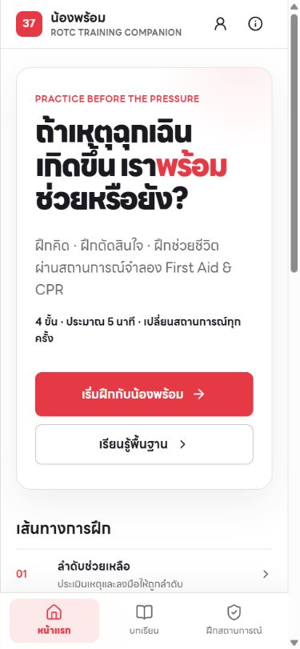

### 02 — เปิดสถานการณ์ · ทางเริ่มชัด

มีปุ่มหลักเดียวและคำอธิบายว่าไม่โทรจริง/ไม่แทนการฝึกภาคปฏิบัติ หัวเรื่องใหญ่และรายละเอียดหลายชั้นทำให้ต้องอ่านมากก่อนเริ่ม สีข้อความรองควรวัด contrast เพิ่ม

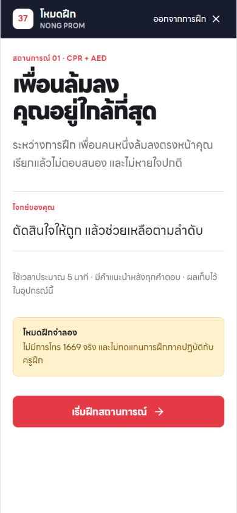

### 03 — จัดลำดับช่วยเหลือ · ต้องเลื่อนมาก

เลือกเจ็ดรายการ จัดลำดับและตรวจคำตอบได้จริง มีชื่อควบคุมเลื่อนขึ้น/ลงใน accessibility tree แต่คำเกริ่นกับพื้นที่ลำดับว่างทำให้เห็นตัวเลือกได้ไม่กี่ข้อในจอแรก สีแดงในภาพอาจเป็น hover/focus ของตำแหน่งเมาส์ จึงไม่สรุปว่าเป็น feedback ผิดก่อนตอบ

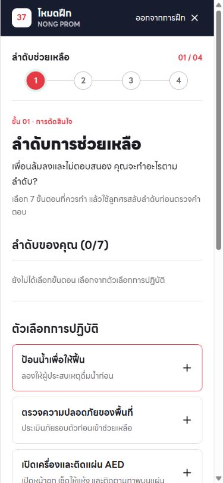

### 04 — แจ้งเหตุ 1669 · แยกคำถามกับตัวเลือกดี

คำถามอยู่บนแผง navy ตัวเลือกอยู่ด้านล่าง ตอบแล้วแสดง feedback และปุ่มรับสายต่อ เดินครบหกคำถามด้วยข้อมูลจำลอง ไม่โทรหรือส่งเบอร์จริง คำว่า “ฟังคำถาม” ควรตรงกับช่องทางจริง เพราะรอบ production นี้ไม่มีเสียงถามที่ตรวจพบ

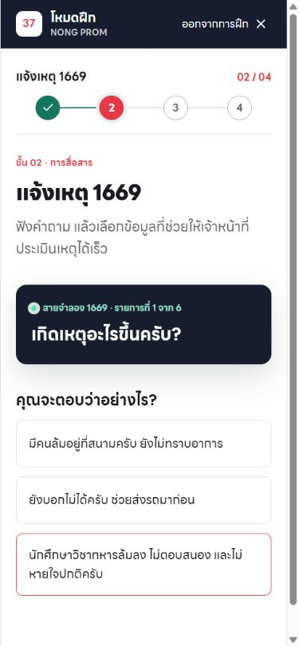

### 05 — พร้อมเริ่ม CPR · ซ้ำชื่อกิจกรรม

มีปุ่มเริ่มชัด แต่ชื่อ CPR และ “ฝึกจังหวะ CPR” พร้อมเป้าหมายปรากฏหลายจุดก่อนเริ่ม ควรย่อความซ้ำ ไอคอนตกแต่งไม่จำเป็นสำหรับขั้นลงมือ

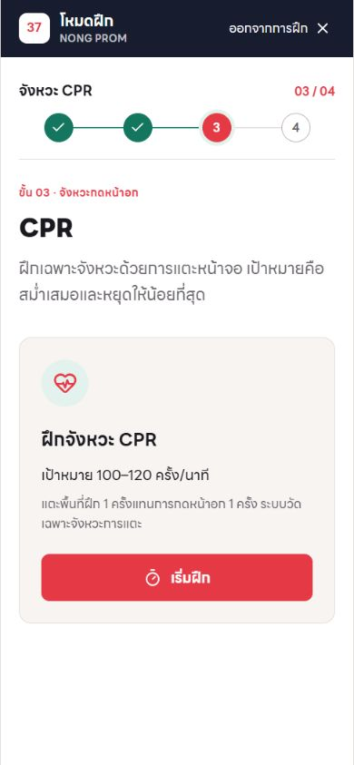

### 06 — พื้นที่แตะ CPR · จุดลงมือชัด แต่ต่ำกว่าจอแรก

PUSH มีขนาดใหญ่และสีเด่น แต่มีหัวเว็บ progress และข้อความก่อนพื้นที่ลงมือ ทำให้ต้องเลื่อนเมื่อเริ่ม ภาพนี้เป็น full-page เพื่อเห็นทั้งพื้นฝึก ไม่ใช่ทั้งหมดที่เห็นพร้อมกันในมือถือ

แตะครบ 30 ครั้งด้วย automation เพื่อเดิน flow เท่านั้น ไม่ได้ทดสอบความแม่นยำ BPM หรือคุณภาพการฝึกจังหวะ และไม่ตีความคะแนนรอบนี้เป็นความสามารถของผู้ใช้

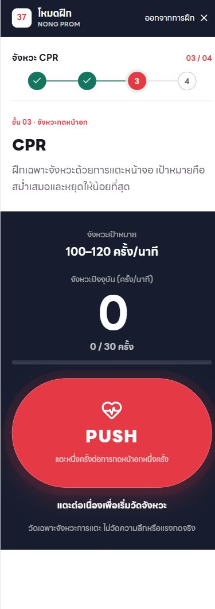

### 07 — AED เปิดเครื่อง · คำสั่งหลักชัด แต่ปุ่มออกหายทางสายตา

H1 บอกงานหลัก มีปุ่มเปิดเครื่องจำลอง แผงเครื่องเพิ่มพื้นที่แต่ยังเป็นข้อความสถานะ ปุ่มออกอยู่ใน tree และมีพื้นที่ 128.7×44px แต่ foreground/background ของ header เป็นขาวเหมือนกัน ยืนยันด้วย DOM computed styles ไม่ใช่ข้อสันนิษฐานจากภาพอย่างเดียว

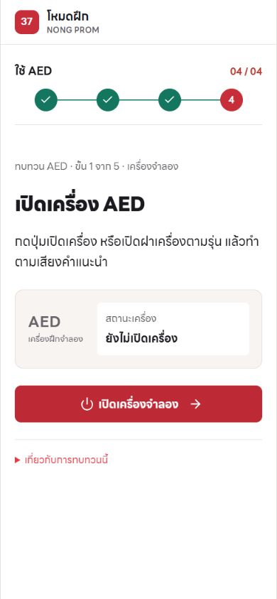

### 08 — AED ติดแผ่น · ขาดภาพทบทวน

ข้อความบอกให้ติดตามภาพของเครื่อง แต่ในแอปไม่มีภาพแผ่น/ตำแหน่ง ผู้เรียนกด “ทบทวนแล้ว” ได้โดยไม่ต้องสังเกตอะไร ควรเพิ่มภาพที่ถูกต้องและตรวจโดยผู้เชี่ยวชาญ โดยยังระบุว่าเป็น guided review ไม่ใช่การทดสอบทักษะ

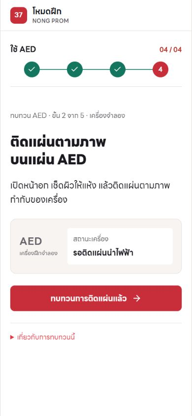

### 09 — AED เคลียร์พื้นที่ · คำเตือนอยู่ก่อนปุ่ม

ตำแหน่งคำเตือนเหมาะสม มีข้อความและสัญลักษณ์ไม่ใช้สีอย่างเดียว แต่คำสั่ง รายละเอียด และกล่องเหลืองซ้ำความหมาย ควรย่อเพื่อให้สแกนง่าย ไม่เอาคำเตือนออกเพียงเพราะซ้ำ

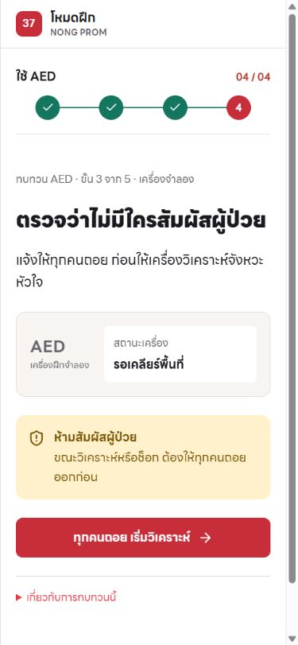

### 10 — AED วิเคราะห์ · guard ทำงาน

ปุ่ม disabled จริงตาม accessibility tree และรอเครื่องจำลอง ไม่พบปุ่มให้ข้ามใน UI ภาพเก็บจาก viewport ขณะที่การคลิกทำให้หน้ามี scroll offset จึงเห็น progress ด้านบนเพียงบางส่วน ไม่ใช่หลักฐานว่าเนื้อหาหายจาก DOM

สถานะเปลี่ยนเองหลังรอ ยังไม่ได้ตรวจการประกาศสถานะด้วย screen reader หรือการพัก timer เมื่อสลับแท็บ

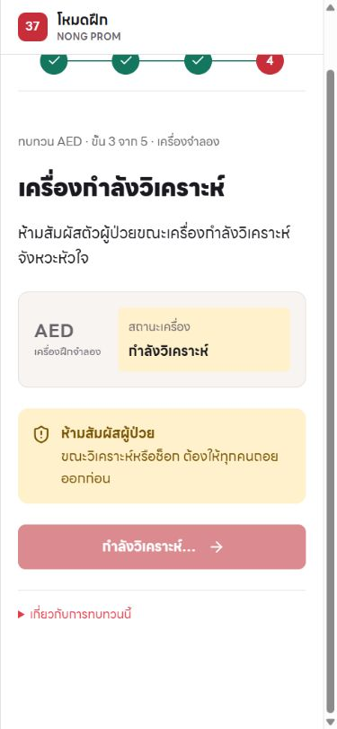

### 11 — AED แนะนำให้ช็อก · ข้อห้ามอยู่ก่อน action

ปุ่มบอก “ช็อกจำลอง” ชัด รักษาคำเตือนก่อนกด แผงสถานะและหัวข้อซ้ำ “แนะนำให้ช็อก” ไม่ควรเพิ่ม character/เอฟเฟกต์ที่แย่งสายตา ภาพ full-page แรกมี sticky-header offset จึงถ่ายใหม่จากด้านบนและใช้ภาพนี้เป็นหลักฐาน

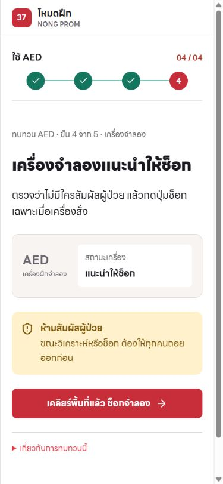

### 12 — AED กลับ CPR · คำสั่งกับปุ่มปลายทางไม่ตรงกันทั้งหมด

H1 บอกกลับ CPR แต่ปุ่มพาไปดูผล ไม่ใช่ฝึกกดต่อ ต้องออกแบบให้ชัดว่า “ในเหตุจริงกลับ CPR; ในบททบทวนนี้ดูผล” ไม่สื่อว่าจบการช่วยเมื่อกดครบ

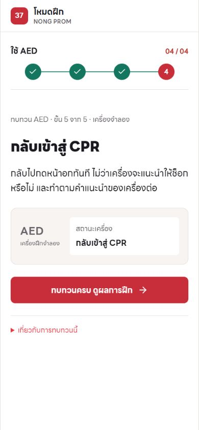

### 13 — AED บน tablet · ไม่ล้นในขั้นที่ตรวจ

ที่ 768×1024 document scrollWidth เท่ากับ innerWidth 768 แสดงชื่อแต่ละกิจกรรมได้ แต่ progress และระยะว่างก่อนคำสั่งยังใช้พื้นที่มาก ปุ่มออกยังขาวบนขาว การตรวจนี้ไม่ใช่เครื่อง iPad จริง

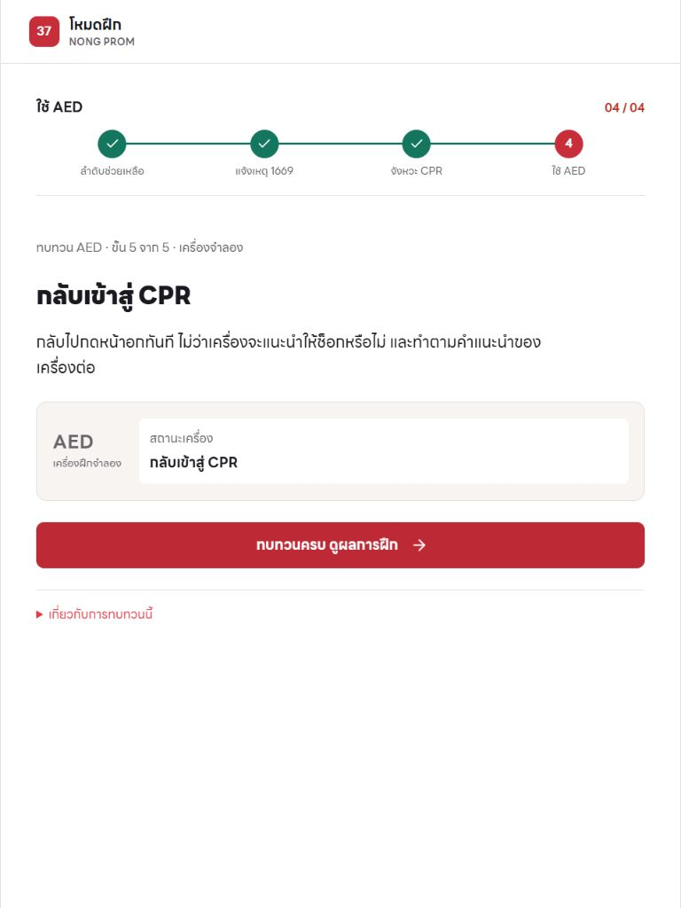

### 14 — AED บน desktop · โครงสร้างอ่านได้ แต่ซ้ำแบบมือถือ

ที่ 1440×900 document scrollWidth เท่ากับ innerWidth 1440 พื้นงานกลางประมาณ 760px ไม่ควรเติมคอลัมน์ตกแต่งเพียงเพราะเหลือที่ว่าง ยังคงพบปุ่มออกมองไม่เห็น

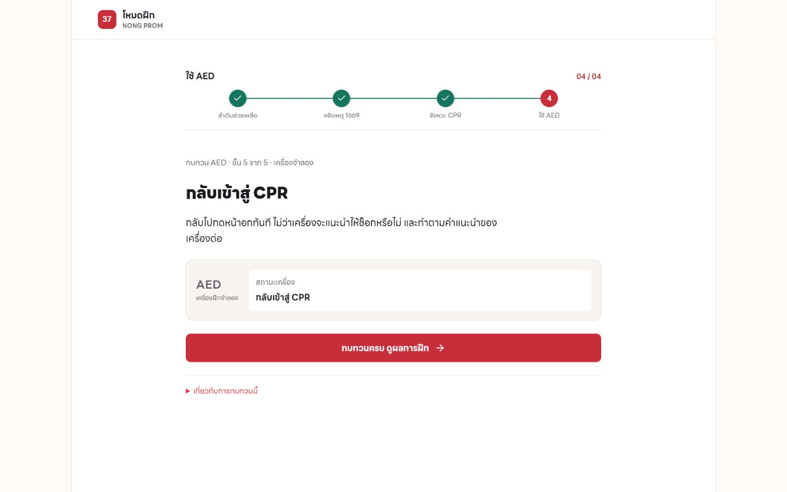

### 15 — ผลสรุป · วัดจริงแยกจาก AED แต่ข้อมูลซ้ำ

ผลระบุคะแนนสามส่วน และ AED ทบทวนครบโดยไม่คิดคะแนน มีข้อความจำกัดการประเมินใน DOM แต่ต้องเลื่อนจึงอ่านได้ ภาพจอแรกแสดงผลสามส่วนและกราฟซ้ำก่อนถึงสิ่งที่ควรทบทวน ควรรวมและย้ายคำแนะนำขึ้น

รอบทดสอบไม่ล็อกอิน ผลนี้บันทึกเฉพาะประวัติของเบราว์เซอร์ที่ใช้ตรวจ ไม่ส่งคะแนนเข้าโปรไฟล์หรืออันดับ

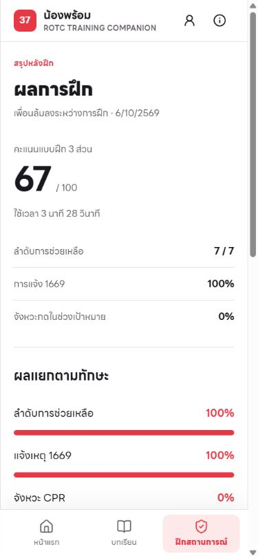

## ข้อจำกัดและงานตรวจต่อ

- ตรวจ AED เฉพาะ shock branch ในรอบนี้ ยังไม่มีภาพ no-shock branch จึงไม่อ้างว่าตรวจครบทุกเส้นทาง
- ตรวจ 390px ทั้ง flow; 768/1440 เฉพาะ resume ไม่ครอบคลุมทุกหน้าทุก breakpoint
- ไม่ได้ตรวจ keyboard ครบ, screen reader จริง, contrast ทุกคู่สี, zoom 200%, reduced motion, offline หรือความเร็วเครือข่าย
- ไม่มี usability test กับผู้เรียนจริง จึงเป็น heuristic + interaction evidence ไม่ใช่ผลวัด cognitive load
- ไม่แก้ source ไม่สร้างภาพ ไม่สร้างไฟล์ Figma และไม่ deploy ในรอบ audit
- ภาพ 13/14 ครั้งแรกถูกตัดหลัง resize จึงไม่ใช้เป็นหลักฐาน และถ่ายใหม่หลังยืนยันขนาดแล้ว

## Brief สำหรับแบบ 3 ทางเลือก

แบบทั้งสามต้องแก้ P1 เหมือนกัน คงคำสั่งเดียวต่อขั้น มี warning ก่อน action ไม่เพิ่มภาพที่ไม่ผ่านการตรวจ และมีระบบสีสอดคล้อง ไม่ใช่เพียงเปลี่ยน palette:

1. Field Guide: ย่อ progress ใช้ตัวอักษรและพื้นที่ว่าง แผงเครื่องเล็ก ภาพสอนเฉพาะจุด
2. Task Focus: คำสั่ง + ภาพ/สถานะจำเป็น + ปุ่มอยู่ในพื้นที่หลักเดียว เหมาะกับมือถือ
3. Training Companion: ความชัดแบบ Task Focus เพิ่มตัวละครเฉพาะเริ่ม/จบ ไม่อยู่ช่วงวิเคราะห์หรือช็อก

ขั้นต่อไปคือทำภาพทางเลือกจาก screenshot ชุดนี้ให้เลือกหนึ่งทิศก่อนผลิต asset และจัด Figma ตามแบบที่เลือก ห้ามนำคำบรรยายทางเลือกนี้ไปลงโค้ดโดยยังไม่มีภาพที่เลือก
