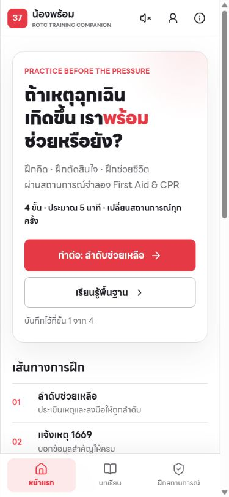
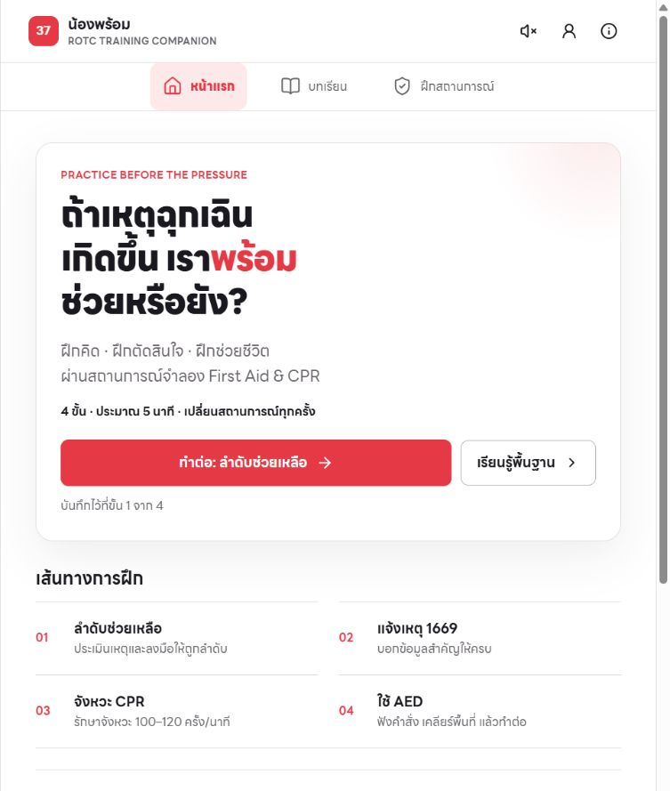
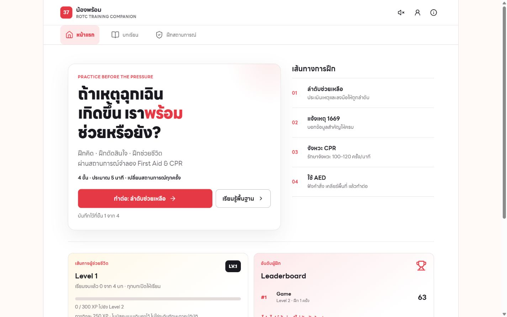

# ตรวจและปรับหน้าแรก — 6 ตุลาคม 2026

ใช้ Product Design Audit ตรวจภาพหน้าแรกของ rordor37.vercel.app ก่อนปรับ และตรวจฉบับแก้ไขในเครื่อง ทั้ง development และ production build โดยคงสี ฟอนต์ LINE Seed Sans TH ข้อความหลัก และระบบ XP เดิม ไม่มี deploy หรือ commit

## ขั้นตอนและผล

1. หน้าแรกมือถือ 390 px ก่อนปรับ — ใช้งานได้ แต่หัวเรื่องและช่องว่างกินพื้นที่มาก รายการเส้นทางมีลูกศรทั้งที่กดไม่ได้ (`01-before-mobile.png`)
2. หน้าแรกไอแพด 768 px ก่อนปรับ — ใช้งานได้ แต่หัวเรื่อง 52 px และรายการเรียงเดี่ยวทำให้เนื้อหายาว (`02-before-tablet.png`)
3. หน้าแรกคอม 1440 px ก่อนปรับ — ใช้งานได้ แต่กล่องเริ่มฝึกกับรายการไม่ชิดแนวบนเดียวกัน (`03-before-desktop.png`)
4. หลังปรับที่ 320/390/768/1440 px — ไม่พบเนื้อหาล้นแนวนอน ปุ่มหลักอยู่ใน viewport แรก มือถือปุ่มไม่ถูกเมนูล่างบัง ตรวจ production build ซ้ำ (`final-320.png`, `final-390.png`, `final-768.png`, `final-1440.png`)
5. ปุ่มเรียนรู้พื้นฐาน — เปิดหน้าบทเรียน 4 บทได้ จากการตรวจฉบับ production ในรอบนี้
6. ปุ่มเริ่มฝึก — เข้าสถานการณ์ได้โดยไม่ต้องเข้าสู่ระบบ จากนั้นออกจากการฝึกกลับหน้าแรกได้ และปุ่มเปลี่ยนเป็นทำต่อขั้นที่ 1 (`05-start-flow.png`)

## สิ่งที่ปรับ

- หัวเรื่องเฉพาะหน้าแรก: 28–36 px บนมือถือ, 40 px ตั้งแต่ 640 px และ 44 px บนคอม ระยะบรรทัด 1.25 ไม่บีบอักษรไทยเท่าเดิม
- ลด padding ในกล่องแรกและระยะห่างก่อนปุ่ม รักษาพื้นที่กดขั้นต่ำ 54 px สำหรับปุ่มหลัก
- เพิ่มข้อความรายการเป็น 16/26 px และข้อความรอง 14/22 px
- เส้นทางการฝึกเป็น 2 คอลัมน์ในแท็บเล็ต และกลับเป็นรายการแนวตั้งข้างกล่องแรกบนคอม
- ลบลูกศรหลอกว่ารายการเส้นทางกดได้ ไม่เปลี่ยนรายการให้เป็นทางลัดใหม่โดยพลการ
- ปรับส่วนหัวจอไม่เกิน 420 px ให้มีที่สำหรับปุ่มเสียง โปรไฟล์ และข้อมูล ไม่ลดพื้นที่กด 44 px

## ผลวัดจาก production build

| viewport | scrollWidth | หัวเรื่อง | ขอบล่างปุ่มหลักจากบนจอ |
|---|---:|---:|---:|
| 320 × 740 | 305 | 28 px | 479.6 px |
| 390 × 844 | 375 | 31.232 px | 460.7 px |
| 768 × 1024 | 753 | 40 px | 557.6 px |
| 1440 × 900 | 1425 | 44 px | 590.6 px |

scrollWidth ที่น้อยกว่า viewport มาจากพื้นที่ scrollbar ของเบราว์เซอร์ ไม่ใช่การล้นจอ

## การตรวจโค้ด

ESLint ผ่าน, Vitest 21 tests / 4 files ผ่าน, Next.js production build ผ่าน, git diff --check ไม่พบ whitespace error (มีคำเตือน CRLF จากการตั้งค่า Git เดิม) ไม่พบ error/warn ใน browser log ที่ตรวจรอบสุดท้าย

## ข้อจำกัด

ทดสอบด้วย viewport จำลองในเบราว์เซอร์ ไม่ได้จับมือถือ/iPad จริง ไม่รับรอง Safari, การซูม 200%, screen reader, contrast ทุกสี หรือ accessibility ทั้งระบบ ภาพก่อน/หลังอาจแสดงประวัติและอันดับต่างกันตามข้อมูลที่โหลดจริง ไม่ใช่การเปลี่ยนระบบคะแนน ยังมีข้อความ/สถานะซ้ำในกล่องเกมและผลฝึกที่ควรตรวจเป็นงานแยก

## ภาพหลังปรับ

ขั้นต่อไป: เติมภาพสอนติดแผ่น AED ที่ผ่านตรวจเนื้อหา และเชื่อมแบบ AED ที่เลือกให้เป็น flow ทดลอง ก่อนแก้หน้าฝึกจริง
